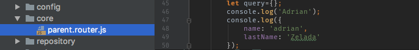
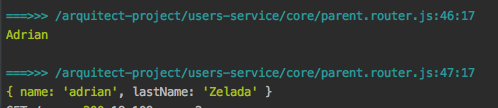

# CSB-INSPECTOR

Many times when developing an application with a Backend written in NodeJs, we tend to send many messages into the terminal “console.log (data)” to help us to keep track of the state of our application, at some point we find tedious to search that printing in the terminal, in some cases we are even mistaken in printing, in some cases we want to identify which file and line of code where that screen printing “console.log (data)” is running because NodeJs only prints the arguments that we pass and does not refer to which file and or in which line of code that print was executed.

**csb-inspector** is a library that identifies the file and code line where the “console.log (data)” screen printing is being executed and shows us the reference of where the printing is being executed.

  

  

If we see the previous image, we can see the reference to the file and line of code that print in the terminal belongs to.
